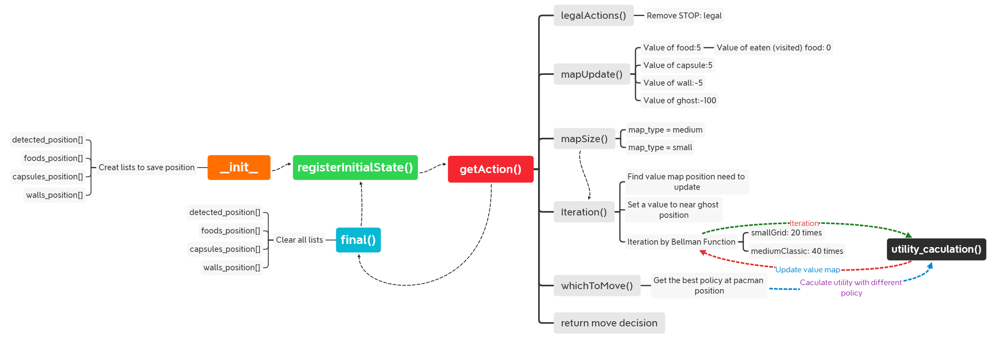
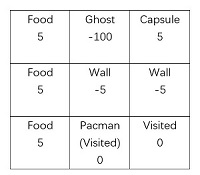
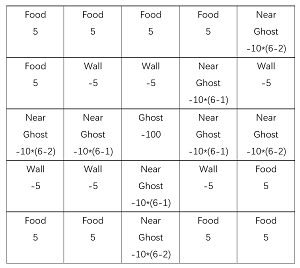
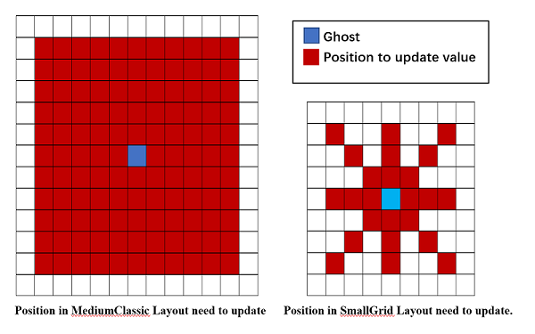
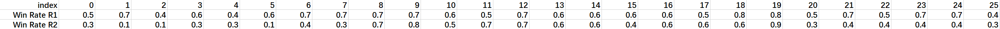

# <center>Pacman MDPAgent Report</center>

**Name: **  *Mingcong Chen* &nbsp;&nbsp;&nbsp;&nbsp;&nbsp;&nbsp;&nbsp;&nbsp;**ID:** *K19007740*

**E-Mail: ** *mingcong.chen@kcl.ac.uk*

## 1. Introduction

Markov Decision Process (MDP) is the optimal decision process of stochastic dynamic system based on Markov theory. The Markov decision process is Markov (no aftereffect, and the next state of the system is only related to the current state information and has nothing to do with the earlier state), but the difference is that MDP considers the action, that is, the system next The state is not only related to the current state, but also to the current action taken.

An MDP should be descripted by a five element tuple $(S, A, P(:,:), R(:,:), \gamma)$ in which $S$ is a finite set of states, A is a finite set of actions, $P$ is a state transition probability matrix $P_{ss'}^a=\vec{P}[S_{t+1}  = s' | S_t = s,A_t$ $ =a]$, $R$ is reward function $R_s^a = \vec{E}[R_{t+1}|S_t=s,A_t=a]$ and $\gamma$ is a dicount factor $\gamma \in [0,1]$. A policy $\pi$ is a distribution over actions given states $\pi(a|s)=\vec{P}[A_t=a|S_t=s]$, which represents a probability distribution of actions in a given state. That is, $\pi$ represents the probability distribution of any action that the agent may take in the next state $s$.

## 2. Description

This coursework is asking us to create an MDP-solver to work in the Pacman environment. The pacman can know the locations of all the objects in the world (walls, food, capsules, ghosts).

#### 2.1 Flow chart



#### 2.2 Value Map Initialization

After every steps' action we need to initialize the value map by using the pacman state to get all objects locations and give rewards for each state (the locations). 

$S_t = [food, capsule, wall(not \ used \ for \ calculate), ghost, visited] = [5, 5, -5(not\ used\ for\ calculate), -100, 0]$

For example, the value map will look like:



#### 2.3 Iteration with Bellman Equation 

##### i. Judge the layout type

Through the api function ```api.corners()``` we can get the maximum index of row and col. Thus, we can know the layout is samllGrid or mediumClassic. Because the samllGrid is a $7\times7$ size map and mediumClassic is a $20\times11$ size map.

##### ii. Add value to near ghost positions

To make the pacman more afraid for the ghosts. I used a ```for``` loop to set a nagtive value to the position neared the ghosts. The value is $-15\times (3-distance\ with \ ghost\ in\ row \ or col)$ for smallGrid and $-10\times (6-distance\ with \ ghostt\ in\ row \ or \ in col)$ for mediumClassic. 	And if there is a wall between the ghost and near ghost postion the value will not be reset.



##### iii. The position need to update value

To improve the speed of running code, I only use Bellman Equation to update the value at position near ghosts, which is a square within $5\times 5$ for mediumClassic and the diagonal and cross within $3\times 3$ for smallGrid.



##### iv.  Iteration by Bellman equation

To find the best policy for the given set of rewards in section 2.1. The utility of each state can be computed by Bellman Equation: $U(s)=R(s)+\gamma\ max_{a\in A(s)} \sum P(s'|s,a)U(s')$. For the value map iteration the equation is Bellman update: $U(s)\leftarrow R(s)+\gamma\ max_{a\in A(s)} \sum P(s'|s,a)U(s')$.

For my program the equation was written as:
$$
U(s)\leftarrow R(s)+\gamma\ max_{a\in A(s)} \sum P(s'|s,a)U(s')=-1+0.8\ max_{a\in A(s)} \sum P(s'|s,a)U(s').\\where \ R(s)=-1,\gamma=0.8
$$
The value of reward -1 means that the agent does not like the environment and try to finish the game by eating food and capsule whose value is larger than 0. The discount factor 0.8 models that the agent will consider a lot of the future rewards. The Bellman update will be iterated 20 times in smallGrid and 40 times in mediumClassic.

##### v. The utilities calculation

Follow the Bellman equation, we have to get the maximum utility of the coordinate as it's value, which means we have to find the optimal policy for each movement. Assume the Pacman is an AI (Artifical Idiot) instead of an AI (Artificial Intelligence). 70% of the time the agent moves as intended and 10% for each other directions. Obviously, there will be four policy $\pi_0=Go\ North $, $ \pi_1=Go\ South$, $\pi_2=Go\ West$,$ \pi_3=Go\ East$.  And if there is a wll in the move deriction the agent will stay it's current position. The utility under policy can be written as:
$$
U^{\pi}(s')=\sum P(s'|s,\pi_i(s))U(s')\\=0.7*U(s'|s,a)+0.1*U(s'_1|s,a_1)+0.1*U(s'_2|s,a_2)+0.1*U(s'_3|s,a_3)\\(If\ s_n' \ in\ walls, s_n'=s_n \ a_n=Stay)
$$
There are 4 utilities were calculated and the largest one will be the value of the coordinate in value map. After 20 or 40 times iteration, the updated value map will be generated.
#### 2.4 Best Policy and The Decision

After updating the value map by Iteration, the last thing we have to do is get the policy at the pacman current position. We can get the largest utility by using the same equation in last section.  At the same time, the policy leads to the largest utility is the optimal policy for pacman current state and it also will be the pacman movement decision.
$$
\pi_{i+1}=arg\ max_{a\in A(s)}\sum P(s'|s,a)U_i(s') 
$$
## 3. Results

#### 3.1 Evaluation

I ran the MDPAgent 100 times in mediumClassic in which the pacman won 57 times with the average score 734.36 and 100 times in smallGrid with 75 times winning and 247.62 average score.

#### 3.2 Hypothesis Testing

##### i. Introduction 

Use two different reward $R_1=-1,R_2=1$ of Bellman equation and compare the result so that we can conclude whether the reward will affect the win rate. Run the two version program 10 times in mediumClassic and repeat 25 times.

```shell
mycount=0; while (( $mycount < 10 )); do python pacman.py  -q -n 10 -p MDPAgent -l mediumClassic;((mycount=$mycount+1)); done;
```

##### ii. Hypothesis

Null hypothesis: The reward will not affect the win rate. 

Alternative hypothesis: The reward will affect the win rate.

##### iii. Student's *t*-test (Two tailed test)

Write the 50 samples (25 for R1 and 25 for R2) into MS Excel. 



And use Python3 to do  Student's *t*-test two tailed test. The probability distribution of the winning rates can be seen below:


 


We can get the value of t is 3.22078 and two-tailed p-value is 0.002249. 

##### iv. Conclusion

Use $\alpha =0.05$ as the Significance Level. For a two tailed test, ${\alpha\over 2} =0.025>p=0.002249$. So we reject null hypothesis and accept alternative hypothesis: The reward will affect the win rate.